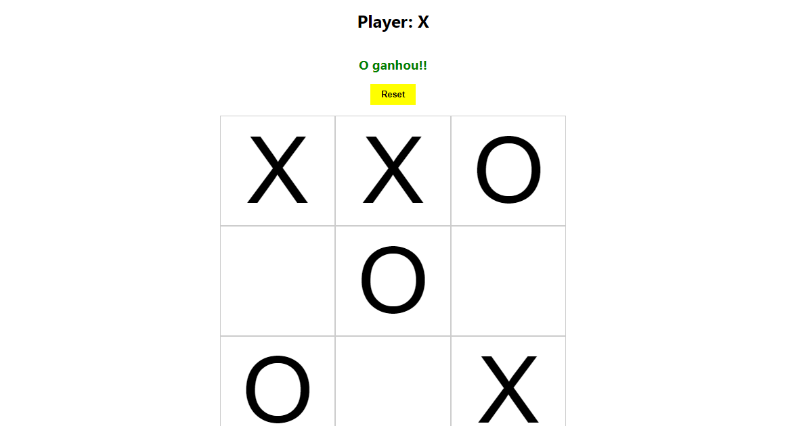

# JOGO DA VELHA

## Descrição do Projeto

Jogo da velha simples.

## Observação

Foram utilizados:
-React Hooks
-Context API

## Demonstração do projeto



## 🛠 Tecnologias

* [**Nodejs**](https://nodejs.org/en/)
* [**Reactjs**](https://pt-br.reactjs.org/)

## 🎲 Rodando o Projeto

```bash
# Clone este repositório
$ git clone https://github.com/Bruno-Cesar123/jogo-da-velha.git

# Acesse a pasta do projeto no terminal/cmd
$ cd jogo-da-velha-react

# Instale as dependências
$ npm install ou yarn

# Execute a aplicação em modo de desenvolvimento
$ npm start ou yarn start

# O servidor inciará na porta:3000 - acesse <http://localhost:3000>
```

## 📝 Licença

Este projeto esta sobe a licença MIT.

Feito por **Bruno Cesar** [**LinkedIn**](https://www.linkedin.com/in/bruno-cesar-b0039715a/)